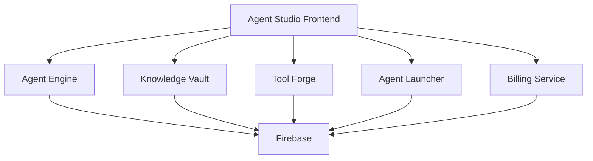

# Agent Engine Integration Guide

This guide explains how the Alchemist Agent Studio frontend integrates with the Agent Engine backend service.

## Overview

The Agent Studio is now a **frontend-only** service that communicates with the Agent Engine microservice for all backend operations. This separation follows microservices architecture principles and eliminates code duplication.

## Service URLs

The frontend connects to these microservices:

- **Agent Engine**: `https://alchemist-agent-engine-851487020021.us-central1.run.app`
- **Knowledge Vault**: `https://alchemist-knowledge-vault-851487020021.us-central1.run.app`
- **Tool Forge**: `https://alchemist-tool-forge-851487020021.us-central1.run.app`
- **Agent Launcher**: `https://alchemist-agent-launcher-851487020021.us-central1.run.app`
- **Billing Service**: `https://billing-service-851487020021.us-central1.run.app`

## Agent Engine API Endpoints

### Authentication
All requests require Firebase authentication tokens in the `Authorization` header:
```
Authorization: Bearer <firebase-id-token>
```

### Core Agent Management

#### List Agents
```http
GET /api/agents?userId=<user-id>
```
Returns all agents owned by the authenticated user.

#### Get Agent Details
```http
GET /api/agents/{agent_id}?userId=<user-id>
```
Returns configuration and details for a specific agent.

#### Create Agent
```http
POST /api/agents
Content-Type: application/json

{
  "agent_type": "custom",
  "config": {...},
  "userId": "<user-id>"
}
```

#### Update Agent
```http
PUT /api/agents/{agent_id}
Content-Type: application/json

{
  "config": {...},
  "userId": "<user-id>"
}
```

### Conversations

#### Get Agent Conversations
```http
GET /api/agents/{agent_id}/conversations?userId=<user-id>
```
Returns conversation history for an agent.

**Response Format:**
```json
{
  "status": "success",
  "conversations": [
    {
      "id": "message-id",
      "conversation_id": "agent-id",
      "content": "message content",
      "role": "user|assistant",
      "timestamp": "2023-..."
    }
  ]
}
```

### Alchemist Interaction

#### Chat with Agent
```http
POST /api/alchemist/interact
Content-Type: application/json

{
  "message": "user message",
  "agent_id": "agent-id",
  "user_id": "user-id"
}
```

**Response Format:**
```json
{
  "status": "success",
  "conversation_id": "agent-id",
  "response": "agent response",
  "thought_process": [...]
}
```

### Knowledge Base

#### Get Knowledge Base Files
```http
GET /api/agents/{agent_id}/knowledge?userId=<user-id>
```
Returns uploaded files for an agent's knowledge base.

#### Upload Configuration Files
```http
POST /api/agents/{agent_id}/config
Content-Type: multipart/form-data

file: <yaml-file>
userId: <user-id>
```
Supports both OpenAPI specifications and MCP configuration files. OpenAPI files are automatically converted to MCP configs.

### Agent Prompts

#### Get Agent System Prompt
```http
GET /api/agents/{agent_id}/prompt?userId=<user-id>
```
Returns the system prompt for an agent.

### Health Check

#### Service Health
```http
GET /health
```
Returns service health status and component availability.

## Frontend Configuration

### Environment Variables

Configure these in `.env`:

```env
# Core service URLs
REACT_APP_AGENT_ENGINE_URL=https://alchemist-agent-engine-851487020021.us-central1.run.app
REACT_APP_KNOWLEDGE_VAULT_URL=https://alchemist-knowledge-vault-851487020021.us-central1.run.app
REACT_APP_TOOL_FORGE_URL=https://alchemist-tool-forge-851487020021.us-central1.run.app

# Firebase configuration
REACT_APP_FIREBASE_API_KEY=your-api-key
REACT_APP_FIREBASE_PROJECT_ID=alchemist-e69bb
# ... other Firebase config
```

### API Service Configuration

The frontend uses axios instances configured in `src/services/config/apiConfig.js`:

```javascript
import { AGENT_ENGINE_URL } from './apiConfig';

export const api = axios.create({
  baseURL: AGENT_ENGINE_URL,
  headers: {
    'Content-Type': 'application/json'
  }
});
```

## Authentication Flow

1. User signs in via Firebase Auth
2. Frontend obtains Firebase ID token
3. All API requests include token in Authorization header
4. Agent Engine validates token with Firebase Admin SDK
5. User ID is extracted from validated token for authorization

## Error Handling

### Common Error Responses

#### 401 Unauthorized
```json
{
  "status": "error",
  "message": "User ID is required for this operation"
}
```

#### 403 Forbidden
```json
{
  "status": "error", 
  "message": "You do not have permission to access this agent"
}
```

#### 404 Not Found
```json
{
  "status": "error",
  "message": "Agent not found"
}
```

#### 500 Server Error
```json
{
  "status": "error",
  "message": "Internal server error"
}
```

## Development Setup

### Local Development

1. **Start Agent Engine locally:**
   ```bash
   cd ../agent-engine
   python main.py
   ```

2. **Update frontend environment:**
   ```env
   REACT_APP_AGENT_ENGINE_URL=http://localhost:8080
   ```

3. **Start frontend:**
   ```bash
   npm start
   ```

### Production Deployment

The frontend is deployed as a static site that connects to production microservices. No backend server is needed in the Agent Studio deployment.

## Troubleshooting

### Connection Refused Errors

If you see `net::ERR_CONNECTION_REFUSED` errors:

1. **Check service URLs** in `.env` file
2. **Verify Agent Engine is running** at the configured URL
3. **Check network connectivity** to the service endpoints
4. **Verify CORS configuration** in Agent Engine

### Authentication Errors

1. **Check Firebase configuration** in both frontend and Agent Engine
2. **Verify ID token generation** in browser developer tools
3. **Check token expiration** and refresh logic

### CORS Issues

Agent Engine includes comprehensive CORS configuration. If issues persist:

1. **Check request headers** in browser developer tools
2. **Verify OPTIONS preflight requests** are handled
3. **Check Agent Engine logs** for CORS-related errors

## Service Dependencies



The Agent Studio frontend is now purely a client-side application that orchestrates interactions with multiple backend microservices, with Agent Engine serving as the primary backend for agent management operations.